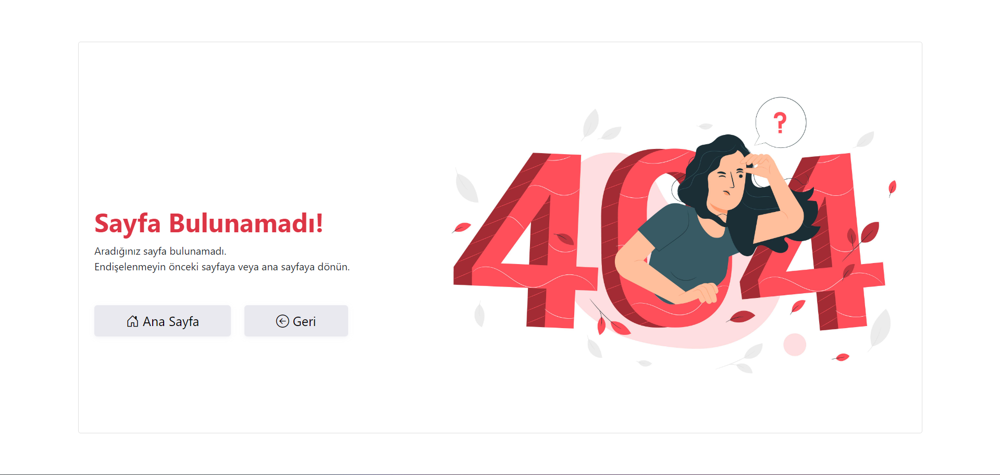

<h1>Cinctruct MVC Template</h1>

<h3 align="center">
    
</h3>

<h2>Overview</h2>

This ASP.NET Core MVC template provides a robust foundation for building modern web applications. It includes essential components such as HTTP API service handling, session management, custom middleware for cache control and status code handling, and more. Designed for scalability and maintainability, this template streamlines development processes and enhances application performance.

 

<h2>Features</h2>

* **`HTTP API Service:`** Simplifies communication with external services using **`IHttpApiService`** and **`HttpApiService`** for various HTTP methods.
* **`Session Management:`** Handles user session data efficiently with **`SessionExtensions`** and **`SessionFilter`**.
* **`Custom Middleware:`** Includes **`CacheControlHandler`** for managing cache policies and **`StatusCodeHandler`** for custom error handling and redirection.
* **`Flexible Base Controller:`** Provides a base controller with built-in session validation and redirection logic.

 

<h2>Status Code Pages</h2>

The Status Code Pages provide customized responses for different HTTP status codes. This feature enhances user experience by directing users to appropriate pages based on the response status from the server. Here are the available status code pages:

1. **UnAuthorize Page:** Displays when users attempt to access resources they are not authorized to view. This page informs users of authorization issues and directs them to log in or contact support.

2. **NotFound Page:** Shows when a requested resource cannot be found on the server. It provides a friendly message and suggestions for navigating back to the main site or searching for the desired content.

3. **Error Page:** Appears for general server errors or unexpected issues. This page informs users of the problem and provides guidance on how to proceed or contact support.

<h2>Usage</h2>

1. **`Setup:`** Add the template to your ASP.NET Core MVC project by installing the necessary NuGet packages and configuring services in **`Program.cs`**.
2. **`API Integration:`** Utilize **`HttpApiService`** for making API calls. Configure service URLs in **`appsettings`**.json and handle responses in your controllers.
3. **`Session Management:`** Use **`SessionExtensions`** for session data storage and retrieval. Apply **`SessionFilter`** to protect your routes from unauthorized access.
4. **`Middleware:`** Integrate **`CacheControlHandler`** and **`StatusCodeHandler`** in your middleware pipeline to manage cache policies and handle errors gracefully.

 

<h2 align="center">⚒️ Languages-Frameworks ⚒️</h2>

 

  
  
  
  
  
  
  
  
  
  
  
  
  

